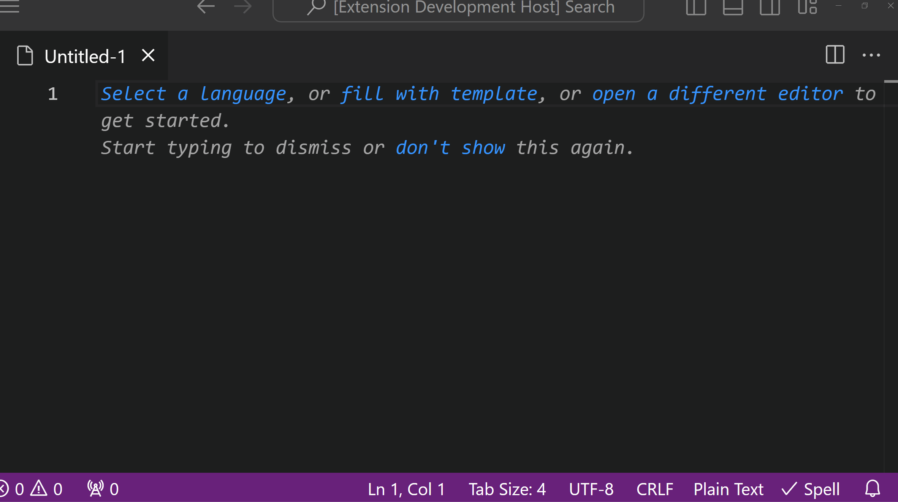

# EARS For Visual Studio Code

Using Alistair Mavin's [EARS Syntax][EARS] (Easy Approach to Requirements Syntax), this _Visual Studio Code_ extension aids business and technical stakeholders write clear and unambiguous software requirements using everyday language.  The documentation process is enhanced by features like _syntax highlighting_ and automatic template generation (via _snippets_).

## Features

### Syntax Highlighting

- Automatically highlights EARS patterns and keywords to improve readability and focus.
  
### Code Completion

- Use intelligent snippets to quickly insert EARS patterns, such as "When [trigger], the system shall [response]."

### Markdown Compatible

- Use both EARS and Markdown syntax within the same document.

## Installation

1. Open VS Code.
2. Go to the Extensions view by clicking the Extensions icon in the Activity Bar on the side of the window.
3. Search for `EARS Syntax`.
4. Click the Install button.

## Usage

- Once installed, the syntax highlighting is automatically applied to `.ears` or `.txt` files where EARS requirements are written.
  
- To use code completion, start typing an EARS pattern and the snippet suggestions will appear. Simply select the desired snippet and it will auto-complete the sentence structure for you.

## Configuration

No additional configuration is required to use this extension. However, you can modify your VS Code settings to better suit your needs.

## Contributing

If you would like to contribute, please fork the repository and make changes as you'd like. Pull requests are warmly welcomed.

## License

MIT License. See the [LICENSE](LICENSE.txt) file for more details.

---

For any issues, suggestions, or updates, please [create an issue](https://github.com/BlueDotBrigade/ears-syntax-vscode/issues) or submit a pull request.

[EARS]: https://alistairmavin.com/ears/
